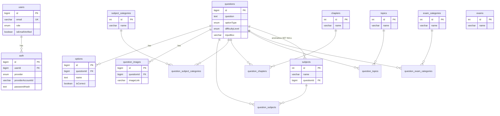
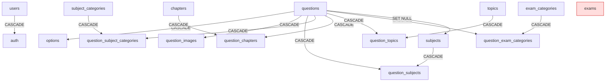
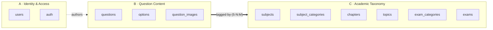

# `test_series_db` — PostgreSQL Database Technical Documentation

> **Source of truth:** Every statement below was obtained by live inspection of the running database through the PostgreSQL MCP server. Nothing here is assumed.
>
> - **Server:** PostgreSQL 17.10 on x86_64-windows (msvc-19.44.35226, 64-bit)
> - **Database:** `test_series_db`
> - **Inspected as user:** `postgres`
> - **Inspection date:** 2026-07-18
> - **Schemas inspected:** `public` (only non-system schema present)
>
> Where a column-level or business-level description could not be read from the database (all `col_description`/`obj_description` values were `NULL`), the description is explicitly marked **(inferred from naming)**. Anything the MCP server could not return is stated as *"Not discoverable from PostgreSQL MCP."*

---

## Table of Contents

1. [Database Overview](#1-database-overview)
2. [Schema Documentation](#2-schema-documentation)
3. [Table Documentation](#3-table-documentation)
4. [Relationships](#4-relationships)
5. [Index Analysis](#5-index-analysis)
6. [Functions & Triggers](#6-functions--triggers)
7. [Enums, Domains, Types & Extensions](#7-enums-domains-types--extensions)
8. [Sequences](#8-sequences)
9. [Database Review](#9-database-review)
10. [Module Analysis](#10-module-analysis)
11. [Diagrams](#11-diagrams)
12. [Scorecard](#13-scorecard)
13. [Data Observations](#14-data-observations)

---

## 1. Database Overview

### Purpose (inferred from naming and data)

`test_series_db` backs an **online test-series / exam question-bank application** — the kind used by an EdTech platform to author multiple-choice and numerical practice questions, tag them along academic dimensions (subject, subject-category, chapter, topic, exam-category), attach answer options and images, and let authenticated staff manage them.

The naming convention (camelCase columns `createdAt`/`updatedAt`, snake_case junction tables, `enum_<table>_<column>` enum type names, auto-generated `<table>_<col>_key` unique names) is the unmistakable fingerprint of a **Sequelize ORM** (Node.js) application using `sequelize.sync()`.

### Architecture Overview

- Single logical schema (`public`); no multi-tenant schema separation.
- A central `questions` fact table linked to five academic taxonomy dimensions through **many-to-many junction tables**.
- Satellite one-to-many tables for `options` and `question_images`.
- A small identity subsystem (`users` + `auth`) with local + Google authentication providers.
- Pure relational design — **no views, materialized views, triggers, stored functions, or row-level security**. All business logic lives in the application layer.

### Object Counts (live)

| Object type | Count | How discovered |
|---|---:|---|
| Schemas (non-system) | 1 | `pg_namespace` |
| Base tables | 16 | `pg_class relkind='r'` |
| Partitioned tables | 0 | `pg_class relkind='p'` |
| Views | 0 | `pg_class relkind='v'` |
| Materialized views | 0 | `pg_class relkind='m'` |
| Foreign tables | 0 | `pg_class relkind='f'` |
| Sequences | 11 | `pg_sequence` |
| Indexes | 71 | `pg_index` |
| Primary keys | 16 | `pg_constraint contype='p'` |
| Foreign keys | 13 | `pg_constraint contype='f'` |
| Unique constraints | 50 | `pg_constraint contype='u'` |
| Check constraints | 0 | `pg_constraint contype='c'` |
| Triggers (user) | 0 | `pg_trigger` (non-internal) |
| Functions | 0 | `pg_proc` (schema `public`) |
| Procedures | 0 | `pg_proc` (schema `public`) |
| Enum types | 4 | `pg_enum` |
| Domains | 0 | `pg_type typtype='d'` |
| Composite types (standalone) | 0 | *none beyond table row-types* |
| Extensions | 1 (`plpgsql`) | `pg_extension` |
| RLS policies | 0 | `pg_policy` |
| Tables with RLS enabled | 0 | `pg_class relrowsecurity` |

> **Note on the 50 unique constraints / 71 indexes:** 49 of the unique constraints are **duplicate `UNIQUE(email)` constraints on `users`** (`users_email_key` … `users_email_key49`), each with its own backing index. This is a defect, not intentional design — see [§5](#5-index-analysis) and [§12](#12-recommendations).

### Business Domain

EdTech / online assessment (test-series preparation). Inferred from table and enum semantics (`questions`, `options.isCorrect`, `difficultyLevel`, `exam_categories`, `subjects`, `chapters`, `topics`). Not stored as a database comment.

### Schema Summary

All 16 tables, 4 enums, and 11 sequences live in the single `public` schema. There is no separation between identity, content, and taxonomy concerns at the schema level.

---

## 2. Schema Documentation

### Schema `public`

| Attribute | Value |
|---|---|
| **Purpose** | Holds the entire application data model (identity, question content, academic taxonomy). |
| **Objects** | 16 tables, 11 sequences, 71 indexes, 4 enum types. |
| **Dependencies** | Depends only on the `plpgsql` extension (default). No cross-schema or cross-database dependencies discoverable. |
| **Notes** | Owner/privilege details beyond the connected `postgres` superuser were not separately enumerated — **role/permission grants: Not fully discoverable from PostgreSQL MCP** in this pass (no non-default roles were referenced by any object). |

---

## 3. Table Documentation

Legend for column tables: **PK** = primary key · **FK** = foreign key · **U** = participates in a unique constraint/index · **Gen** = generated/identity. All `createdAt`/`updatedAt` columns are `timestamp with time zone`, `NOT NULL`, and **have no database default** (application-managed by Sequelize).

Global facts that apply to every table:
- **Soft-delete strategy:** none. No `deletedAt`, `isDeleted`, `status`, or `archived` column exists on any table. Deletes are physical.
- **Timestamp strategy:** `createdAt` + `updatedAt` (tz-aware) on all entity tables; **absent** on the pure junction tables (`question_*` M2M links) and on `question_topics`. No DB-level `DEFAULT now()`.
- **Audit columns:** only creation/update timestamps; no `createdBy`/`updatedBy` user attribution anywhere.

---

### 3.1 `users`

**Purpose (inferred):** Application accounts — staff who author/manage questions. **Rows: 2.**

| # | Column | Type | Nullable | Default | PK | FK | U | Gen | Description (inferred) |
|---|---|---|:--:|---|:--:|:--:|:--:|:--:|---|
| 1 | id | bigint | no | `nextval('users_id_seq')` | ✔ | | | seq | Surrogate key |
| 2 | name | varchar(255) | no | — | | | | | Display name |
| 3 | email | varchar(255) | no | — | | | ✔ | | Login email (unique) |
| 4 | phone | varchar(255) | yes | — | | | | | Optional phone |
| 5 | role | `enum_users_role` | no | `'teacher'` | | | | | `admin` or `teacher` |
| 6 | isEmailVerified | boolean | no | `false` | | | | | Email-verification flag |
| 7 | createdAt | timestamptz | no | — | | | | | Row creation time |
| 8 | updatedAt | timestamptz | no | — | | | | | Last update time |

- **Primary key:** `users_pkey (id)`
- **Unique constraints:** `email` — **declared 50 times** (`users_email_key`, `users_email_key1..49`), each backed by an identical unique index. **Defect** ([§5](#5-index-analysis)).
- **Foreign keys:** none outbound.
- **Referenced by:** `auth.userId → users.id` (ON UPDATE CASCADE, ON DELETE CASCADE).
- **Triggers:** none.

---

### 3.2 `auth`

**Purpose (inferred):** Authentication credentials / linked identity providers for a user (one row per provider per user). **Rows: 2.**

| # | Column | Type | Nullable | Default | PK | FK | U | Description (inferred) |
|---|---|---|:--:|---|:--:|:--:|:--:|---|
| 1 | id | bigint | no | `nextval('auth_id_seq')` | ✔ | | | Surrogate key |
| 2 | userId | bigint | no | — | | ✔ | ✔ | Owning user |
| 3 | provider | `enum_auth_provider` | no | — | | | ✔ | `local` or `google` |
| 4 | providerAccountId | varchar(255) | yes | — | | | ✔ | External provider account id |
| 5 | passwordHash | text | yes | — | | | | Hash for `local` provider |
| 6 | createdAt | timestamptz | no | — | | | | |
| 7 | updatedAt | timestamptz | no | — | | | | |

- **Primary key:** `auth_pkey (id)`
- **Unique constraint:** `auth_provider_provider_account_id (provider, providerAccountId)` — prevents duplicate linkage of the same external account.
- **Foreign keys:** `userId → users.id` (ON UPDATE CASCADE, ON DELETE CASCADE).
- **Referenced by:** none.

---

### 3.3 `questions` — central fact table

**Purpose (inferred):** A single exam/practice question. **Rows: 1,878.**

| # | Column | Type | Nullable | Default | PK | Description (inferred) |
|---|---|---|:--:|---|:--:|---|
| 1 | id | bigint | no | `nextval('questions_id_seq')` | ✔ | Surrogate key |
| 2 | question | text | no | — | | Question stem (may hold HTML/markup) |
| 3 | explanation | text | yes | — | | Answer explanation |
| 4 | hint | text | yes | — | | Optional hint |
| 5 | optionType | `enum_questions_optionType` | no | `'Single'` | | `Single` / `Multiple` / `Numerical` |
| 6 | difficultyLevel | `enum_questions_difficultyLevel` | no | `'easy'` | | `easy` / `moderate` / `hard` |
| 7 | createdAt | timestamptz | no | — | | |
| 8 | updatedAt | timestamptz | no | — | | |
| 9 | inputBox | varchar(255) | yes | `NULL::varchar` | | Numeric-answer input (for `Numerical` type) (inferred) |

- **Primary key:** `questions_pkey (id)`
- **Foreign keys:** none outbound.
- **Referenced by (all ON UPDATE CASCADE, ON DELETE CASCADE unless noted):** `options`, `question_images`, `question_subjects`, `question_subject_categories`, `question_chapters`, `question_topics`, `question_exam_categories`, and `subjects.questionId` (**ON DELETE SET NULL** — see the design note in [§9](#9-database-review)).

---

### 3.4 `options`

**Purpose (inferred):** Answer choices for a question; one question → many options. **Rows: 7,239.**

| # | Column | Type | Nullable | Default | PK | FK | Description (inferred) |
|---|---|---|:--:|---|:--:|:--:|---|
| 1 | id | bigint | no | `nextval('options_id_seq')` | ✔ | | Surrogate key |
| 2 | name | text | no | `''` | | | Option text |
| 3 | isCorrect | boolean | no | `false` | | | Marks the correct choice |
| 4 | questionId | bigint | no | — | | ✔ | Parent question |
| 5 | createdAt | timestamptz | no | — | | | |
| 6 | updatedAt | timestamptz | no | — | | | |

- **PK:** `options_pkey (id)` · **FK:** `questionId → questions.id` (CASCADE/CASCADE).
- **Index note:** no dedicated index on `questionId` beyond the PK — see [§5](#5-index-analysis) (missing FK index).

---

### 3.5 `question_images`

**Purpose (inferred):** Images attached to a question. **Rows: 0.**

| # | Column | Type | Nullable | Default | PK | FK | Description (inferred) |
|---|---|---|:--:|---|:--:|:--:|---|
| 1 | id | bigint | no | `nextval('question_images_id_seq')` | ✔ | | Surrogate key |
| 2 | imageLink | varchar(255) | no | — | | | Image URL/path |
| 3 | questionId | bigint | no | — | | ✔ | Parent question |
| 4 | createdAt | timestamptz | no | — | | | |
| 5 | updatedAt | timestamptz | no | — | | | |

- **PK:** `question_images_pkey (id)` · **FK:** `questionId → questions.id` (CASCADE/CASCADE).

---

### 3.6 Taxonomy dimension tables

These five tables share the identical shape `(id, name, createdAt, updatedAt)` (with `subjects` carrying one extra column). Descriptions are inferred from naming.

| Table | Rows | Purpose (inferred) | PK | Extra columns |
|---|---:|---|---|---|
| `subjects` | 1 | Academic subject (e.g. *physics*) | `subjects_pkey (id)` — **int** | `questionId bigint NULL` (FK → `questions.id`, **ON DELETE SET NULL**) |
| `subject_categories` | 9 | Sub-grouping within a subject | `subject_categories_pkey (id)` — int | — |
| `chapters` | 21 | Chapter within syllabus | `chapters_pkey (id)` — int | — |
| `topics` | 71 | Fine-grained topic | `topics_pkey (id)` — int | — |
| `exam_categories` | 1 | Target exam (e.g. JEE/NEET-style grouping) | `exam_categories_pkey (id)` — int | — |
| `exams` | 0 | Exam definitions (**unreferenced** — no FK points to it) | `exams_pkey (id)` — int | — |

Common columns for each: `id integer NOT NULL (identity seq)`, `name varchar(255) NOT NULL`, `createdAt timestamptz NOT NULL`, `updatedAt timestamptz NOT NULL`.

> **`exams` is an orphan table:** it exists with a PK and sequence but **no foreign key anywhere references it**, and it holds 0 rows. Likely a planned/abandoned feature. (`Not discoverable from PostgreSQL MCP`: the intended relationship — none exists in the live schema.)
>
> **`subjects.questionId` is anomalous:** subjects is a shared dimension, yet it carries a direct FK to a single question. With 1 row in `subjects` vs 1,878 rows in the `question_subjects` junction, this column is effectively dead. See [§9](#9-database-review).

---

### 3.7 Junction (many-to-many) tables

All five link `questions` to a dimension. Each has a **composite primary key** and two cascading FKs. None carry timestamps or surrogate keys.

| Junction table | Rows | Composite PK | FK 1 | FK 2 | Redundant unique index? |
|---|---:|---|---|---|:--:|
| `question_subjects` | 1,878 | `(questionId, subjectId)` | `questionId → questions.id` | `subjectId → subjects.id` | **Yes** (`question_subjects_question_id_subject_id`) |
| `question_subject_categories` | 1,878 | `(questionId, subjectCategoryId)` | `questionId → questions.id` | `subjectCategoryId → subject_categories.id` | **Yes** |
| `question_chapters` | 1,878 | `(questionId, chapterId)` | `questionId → questions.id` | `chapterId → chapters.id` | **Yes** |
| `question_exam_categories` | 1,878 | `(questionId, examCategoryId)` | `questionId → questions.id` | `examCategoryId → exam_categories.id` | **Yes** |
| `question_topics` | 1,883 | `(questionId, topicId)` | `questionId → questions.id` | `topicId → topics.id` | **No** (PK only) |

All FKs above are **ON UPDATE CASCADE, ON DELETE CASCADE**.

> **Asymmetry worth noting:** four of the five junctions have a *second* unique index that duplicates the primary key exactly (`..._question_id_<dim>_id`). `question_topics` does **not**. This inconsistency is a Sequelize migration artifact (`unique: true` on the association plus a composite PK). The duplicate indexes are pure overhead — see [§5](#5-index-analysis).

**Row-count reading:** 1,878 questions each map to exactly one subject / subject-category / chapter / exam-category (1:1 counts), while `question_topics` has 1,883 (five questions carry a second topic, or a small number map to >1 topic). This means four of the "many-to-many" tables are currently used as **one-to-one** in practice, even though the schema permits many-to-many.

---

## 4. Relationships

All foreign keys (13 total) discovered from `pg_constraint`:

| # | Parent (referenced) | Child (referencing) | Column(s) | ON DELETE | ON UPDATE | Cardinality | Business meaning (inferred) |
|---:|---|---|---|---|---|---|---|
| 1 | `users` | `auth` | `userId` | CASCADE | CASCADE | 1 → N | A user has one or more auth/provider records |
| 2 | `questions` | `options` | `questionId` | CASCADE | CASCADE | 1 → N | A question has many answer options |
| 3 | `questions` | `question_images` | `questionId` | CASCADE | CASCADE | 1 → N | A question has many images |
| 4 | `questions` | `question_subjects` | `questionId` | CASCADE | CASCADE | 1 → N | Link side |
| 5 | `subjects` | `question_subjects` | `subjectId` | CASCADE | CASCADE | 1 → N | Link side |
| 6 | `questions` | `question_subject_categories` | `questionId` | CASCADE | CASCADE | 1 → N | Link side |
| 7 | `subject_categories` | `question_subject_categories` | `subjectCategoryId` | CASCADE | CASCADE | 1 → N | Link side |
| 8 | `questions` | `question_chapters` | `questionId` | CASCADE | CASCADE | 1 → N | Link side |
| 9 | `chapters` | `question_chapters` | `chapterId` | CASCADE | CASCADE | 1 → N | Link side |
| 10 | `questions` | `question_topics` | `questionId` | CASCADE | CASCADE | 1 → N | Link side |
| 11 | `topics` | `question_topics` | `topicId` | CASCADE | CASCADE | 1 → N | Link side |
| 12 | `questions` | `question_exam_categories` | `questionId` | CASCADE | CASCADE | 1 → N | Link side |
| 13 | `exam_categories` | `question_exam_categories` | `examCategoryId` | CASCADE | CASCADE | 1 → N | Link side |
| 14 | `questions` | `subjects` | `questionId` | **SET NULL** | CASCADE | 1 → N | Anomalous direct link (see §9) |

> Rows 4–13 combine into five logical **N:M** relationships between `questions` and each taxonomy dimension. Row 14 is the odd one out — the only `ON DELETE SET NULL` in the database.

### Effective N:M relationships

```
questions  ⟷  subjects            (via question_subjects)
questions  ⟷  subject_categories  (via question_subject_categories)
questions  ⟷  chapters            (via question_chapters)
questions  ⟷  topics              (via question_topics)
questions  ⟷  exam_categories     (via question_exam_categories)
```

`exams` participates in **no** relationship.

---

## 5. Index Analysis

**Total indexes: 71.** Breakdown: 16 primary-key indexes + 1 `auth` business unique + 49 duplicate `users.email` + 4 redundant junction uniques + 1 sole `question_topics` PK (counted in the 16). All are B-tree.

### 🔴 Duplicate / redundant indexes (structural — hold regardless of usage stats)

1. **`users.email` — 49 duplicate unique indexes.** `users_email_key` and `users_email_key1` … `users_email_key49` are **identical** (`CREATE UNIQUE INDEX ... ON public.users USING btree (email)`). Only one is needed. The other 48 (plus their matching constraints) are pure write-amplification and storage waste. Classic Sequelize `sync({ alter: true })` bug that re-adds the `unique: true` constraint on every boot.
   - *Usage evidence:* `pg_stat_user_indexes` shows `idx_scan = 0` for these on this instance, but the redundancy is provable from the **identical index definitions** alone and does not depend on scan stats.

2. **Four junction tables carry a unique index identical to their composite PK:**
   - `question_subjects_question_id_subject_id` == PK `(questionId, subjectId)`
   - `question_subject_categories_question_id_subject_category_id` == PK
   - `question_chapters_question_id_chapter_id` == PK
   - `question_exam_categories_question_id_exam_category_id` == PK

   Each duplicates the primary-key index exactly and can be dropped. `question_topics` correctly has only its PK — proving the others are removable.

### 🟠 Missing indexes (FK columns without a supporting index)

Every FK below is a `questionId`/child-side column used for joins and cascade deletes but **has no dedicated index** (only the *parent* side or a composite PK where the FK column is not leftmost):

| Table | Unindexed FK column | Impact |
|---|---|---|
| `options` | `questionId` | 7,239 rows; every "get options for question" query and every cascade delete scans without an index. **Highest-impact miss.** |
| `question_images` | `questionId` | Low now (0 rows) but will matter with data |
| `auth` | `userId` | Low volume, minor |

For the junction tables, the *second* FK column (e.g. `subjectId`, `topicId`) is **not** the leftmost PK column, so reverse lookups (`find all questions for topic X`) are also unindexed. Only the `questionId`-leading composite PK helps forward lookups.

### 🟡 Unused indexes (usage-based — caveated)

`pg_stat_user_indexes` reports `idx_scan = 0` for most indexes (e.g. all `users_email_key*`, `options_pkey`). **This is a development instance**, so zero scans ≠ "unused in production" — do not disable indexes on this basis. The only statistically meaningful signal here is corroborating the duplicate-index finding above, which is already proven structurally.

---

## 6. Functions & Triggers

- **User-defined functions:** none (`pg_proc` in schema `public` returned 0 rows).
- **Procedures:** none.
- **Triggers:** none (`pg_trigger` non-internal returned 0).
- **Trigger functions:** none.

All timestamping, validation, and cascade-beyond-FK logic is handled in the **application layer** (Sequelize). Notably, `createdAt`/`updatedAt` have **no database default and no trigger** — if a row is ever inserted outside the ORM, these `NOT NULL` columns will fail unless explicitly provided.

---

## 7. Enums, Domains, Types & Extensions

### Enum types (4)

| Enum type | Values (in sort order) | Used by |
|---|---|---|
| `enum_users_role` | `admin`, `teacher` | `users.role` (default `teacher`) |
| `enum_auth_provider` | `local`, `google` | `auth.provider` |
| `enum_questions_optionType` | `Single`, `Multiple`, `Numerical` | `questions.optionType` (default `Single`) |
| `enum_questions_difficultyLevel` | `easy`, `moderate`, `hard` | `questions.difficultyLevel` (default `easy`) |

### Domains
None. (`pg_type typtype='d'` returned 0 rows.)

### Composite types
None beyond the implicit row-types of tables.

### Extensions

| Extension | Version |
|---|---|
| `plpgsql` | 1.0 (default) |

No `uuid-ossp`, `pgcrypto`, `citext`, or `pg_trgm` — relevant to the case-sensitivity and UUID notes in [§9](#9-database-review).

### Row-Level Security
**Disabled everywhere.** No table has `relrowsecurity = true`; `pg_policy` contains 0 policies.

---

## 8. Sequences

11 sequences, all owned by their table's `id` column (`INCREMENT 1`, `START 1`).

| Sequence | Owner column | Type ceiling | Last value |
|---|---|---|---:|
| `users_id_seq` | `users.id` | bigint | 2 |
| `auth_id_seq` | `auth.id` | bigint | 2 |
| `questions_id_seq` | `questions.id` | bigint | 1,925 |
| `options_id_seq` | `options.id` | bigint | 7,323 |
| `question_images_id_seq` | `question_images.id` | bigint | *(unused)* |
| `subjects_id_seq` | `subjects.id` | int (2.1B) | 1 |
| `subject_categories_id_seq` | `subject_categories.id` | int | 9 |
| `chapters_id_seq` | `chapters.id` | int | 22 |
| `topics_id_seq` | `topics.id` | int | 71 |
| `exam_categories_id_seq` | `exam_categories.id` | int | 1 |
| `exams_id_seq` | `exams.id` | int | *(unused)* |

> **Type inconsistency:** `questions.id` is `bigint` but the taxonomy `id`s are `integer`. Junction tables faithfully mirror this (`questionId bigint`, `<dim>Id integer`), so FKs are type-correct — but the mixed-width key design is a smell ([§9](#9-database-review)). `questions_id_seq` (1,925) is ahead of the row count (1,878), reflecting deleted rows / rolled-back inserts.

---

## 9. Database Review

### Naming conventions
- **Inconsistent casing:** table names are `snake_case`, but columns are `camelCase` (`questionId`, `isCorrect`, `createdAt`). camelCase identifiers require double-quoting in every hand-written SQL statement — an ergonomic tax. Consistent, but consistently ORM-driven rather than PostgreSQL-idiomatic (`snake_case` throughout is the Postgres norm).
- Enum types follow Sequelize's `enum_<table>_<column>` pattern — predictable.

### Normalization
- Core model is cleanly **3NF**: `questions` fact + taxonomy dimensions + junctions. Good.
- **Violation / redundancy:** `subjects.questionId` introduces a second, contradictory path between `questions` and `subjects` alongside the `question_subjects` junction. Two ways to express the same relationship = update anomaly risk. Given `subjects` has 1 row and the junction has 1,878, the direct FK is **dead weight** and should be dropped.

### Constraints
- Every table has a PK. ✔
- FKs cover all real relationships with sane cascade rules. ✔
- **No CHECK constraints** anywhere — e.g. nothing enforces "a `Single` question has exactly one `option.isCorrect = true`," or non-empty `name`. Integrity of answer-key correctness is entirely application-trusted.
- **49 redundant UNIQUE(email) constraints** — the single worst defect (see below).

### Data types
- `varchar(255)` used reflexively for everything (names, emails, phone, image links) — the arbitrary Sequelize default rather than deliberate sizing. `text` would be equivalent in Postgres with no length guessing.
- `imageLink varchar(255)` may truncate long URLs.
- Mixed `bigint` (users, auth, questions, options) vs `integer` (all dimensions) primary keys.

### Security
- **No RLS, no policies** — all access control is in the app tier.
- `auth.passwordHash` is `text` (correct — not storing plaintext), and password material is isolated in `auth`, not `users`. ✔ Good separation.
- `role` defaults to `teacher` (least-privilege-ish), though both live users are `admin`.
- **Not discoverable from PostgreSQL MCP:** application-level authorization logic, password hashing algorithm, and JWT/session handling (they live in code, not the DB).

### Performance
- **Missing index on `options.questionId`** (7,239 rows) is the top live performance risk.
- **49 duplicate email indexes** inflate every `users` write and the table's index footprint (~784 kB of redundant indexes on a 2-row table — the table is 832 kB total, almost entirely wasted index).
- Redundant junction unique indexes double index-maintenance cost on the busiest link tables.

### Scalability
- Design scales structurally (surrogate keys, junctions). Taxonomy `id`s are `int` (2.1B ceiling) — fine.
- The junctions are provisioned for N:M but used 1:1 today; if the model is genuinely 1:1 (one subject/chapter/exam-category per question), the junctions could be collapsed into FK columns on `questions` for simpler, faster reads. Confirm intended cardinality with product owners before changing.

### Maintainability
- Absence of DB comments (`obj_description`/`col_description` all NULL) means the schema is undocumented at the source; this file is the first authoritative description.
- ORM-managed timestamps with no DB default make out-of-band inserts fragile.

### Findings checklist

| Check | Result |
|---|---|
| Missing PKs | None — all 16 tables have a PK ✔ |
| Missing FKs | `subjects`/`exams` semantics aside, relationships are covered; `exams` intentionally unlinked (orphan) |
| Missing indexes | `options.questionId`, `question_images.questionId`, `auth.userId`, junction reverse-lookup columns |
| Nullable abuse | Minor — `subjects.questionId` nullable (and anomalous) |
| Redundant columns | `subjects.questionId` (duplicate relationship path) |
| Inconsistent naming | snake_case tables vs camelCase columns |
| UUID consistency | No UUIDs used; integer/bigint surrogate keys — but **int vs bigint is mixed** |
| Timestamp consistency | `createdAt`/`updatedAt` consistent on entities, absent on junctions; **no DB defaults** |
| Duplicate constraints/indexes | **49× `users.email`** + 4 junction unique indexes |

---

## 10. Module Analysis

### Module A — Identity & Access
- **Purpose:** Authenticate and identify staff users.
- **Tables:** `users`, `auth`.
- **Relationships:** `auth.userId → users.id` (1:N).
- **Workflow:** A `user` is created; one or more `auth` rows link them to a `local` (password) or `google` provider. `provider + providerAccountId` is unique to prevent duplicate external links.

### Module B — Question Content
- **Purpose:** Store questions and their answer material.
- **Tables:** `questions`, `options`, `question_images`.
- **Relationships:** `questions` 1:N `options`; `questions` 1:N `question_images`.
- **Workflow:** Author creates a `question` (with `optionType`/`difficultyLevel`), attaches `options` (marking `isCorrect`), and optionally `question_images`.

### Module C — Academic Taxonomy
- **Purpose:** Classify questions across academic dimensions.
- **Tables (dimensions):** `subjects`, `subject_categories`, `chapters`, `topics`, `exam_categories`, `exams` (orphan).
- **Junctions:** `question_subjects`, `question_subject_categories`, `question_chapters`, `question_topics`, `question_exam_categories`.
- **Relationships:** five N:M links from `questions`.
- **Workflow:** Each question is tagged with subject / category / chapter / topic / exam-category to power filtering and test-series assembly.

---

## 11. Diagrams

### 11.1 Global ER Diagram



### 11.2 Module C — Taxonomy N:M Detail

```mermaid
erDiagram
    questions ||--o{ question_subjects : links
    subjects ||--o{ question_subjects : links
    questions ||--o{ question_subject_categories : links
    subject_categories ||--o{ question_subject_categories : links
    questions ||--o{ question_chapters : links
    chapters ||--o{ question_chapters : links
    questions ||--o{ question_topics : links
    topics ||--o{ question_topics : links
    questions ||--o{ question_exam_categories : links
    exam_categories ||--o{ question_exam_categories : links

    question_subjects { bigint questionId PK_FK }
    question_subject_categories { bigint questionId PK_FK }
    question_chapters { bigint questionId PK_FK }
    question_topics { bigint questionId PK_FK }
    question_exam_categories { bigint questionId PK_FK }
```

### 11.3 Dependency Graph (delete-cascade direction)



### 11.4 Module Architecture



---


---

## 13. Scorecard

Each score is 1–10 (10 = excellent) with justification grounded in the live findings above.

| Dimension | Score | Justification |
|---|:--:|---|
| **Schema Design** | 6/10 | Clean fact/dimension/junction core, full PK coverage, sensible cascades — but the `subjects.questionId` redundant path, the orphan `exams` table, and junctions used 1:1 pull it down. |
| **Naming** | 6/10 | Internally consistent (Sequelize conventions) and predictable, but snake_case tables vs camelCase columns force quoting and diverge from Postgres idiom. |
| **Performance** | 4/10 | Missing index on the 7,239-row `options.questionId`; 49 duplicate email indexes and 4 redundant junction indexes actively harm write performance. |
| **Security** | 5/10 | Good credential isolation (`auth.passwordHash` separate, hashed) and role enum, but no RLS/policies and all authz is app-side; email not case-normalized. |
| **Normalization** | 7/10 | Largely 3NF; only the duplicate `questions↔subjects` relationship path breaks it. |
| **Scalability** | 6/10 | Surrogate keys + junctions scale; mixed int/bigint keys and unnecessary N:M overhead for 1:1 data are minor drags. |
| **Maintainability** | 4/10 | Uncontrolled `sync({alter})` produced 49 duplicate constraints; no migrations discipline evident; no DB comments; no timestamp defaults. |
| **Documentation Quality** | 2/10 | Zero database-level comments — every `col_description`/`obj_description` is NULL. The schema was entirely self-undocumented before this report. |

**Overall: ~5/10** — a sound relational skeleton undermined by ORM-sync hygiene issues (duplicate constraints), missing hot-path indexing, and one redundant relationship. The critical/high fixes are low-risk and high-impact.

---

## 14. Data Observations

Small live-data notes surfaced during inspection (from actual row reads, 2 users only):

- **`users` id=2** has `name = "ali@gmail.com"` — the `name` column holds an email address, indicating weak/absent input validation on `name`.
- Both users have `role = admin`, even though the column default is `teacher` — no non-admin accounts exist yet.
- Both users have `isEmailVerified = false` despite being admins.
- **Counts confirm 1:1 usage** of four "N:M" junctions (all 1,878, matching `questions`), while `question_topics` = 1,883 (a few multi-topic questions).
- `options` averages ~3.86 rows per question (7,239 / 1,878).
- `question_images` and `exams` are empty (0 rows); `subjects` has a single row (`physics`).

---

### Appendix — Discovery Method

Every fact was read live via the PostgreSQL MCP server against `test_series_db` using `pg_catalog`/`pg_stat_*` system views:
`current_database()`/`version()`, `pg_namespace`, `pg_class`, `pg_attribute`, `pg_attrdef`, `pg_constraint` (with `pg_get_constraintdef`), `pg_index` (with `pg_get_indexdef`), `pg_enum`, `pg_type`, `pg_proc`, `pg_trigger`, `pg_sequence`, `pg_extension`, `pg_policy`, `pg_stat_user_indexes`, plus direct `COUNT(*)` and sample `SELECT`s. No schema detail in this document was assumed or fabricated.
